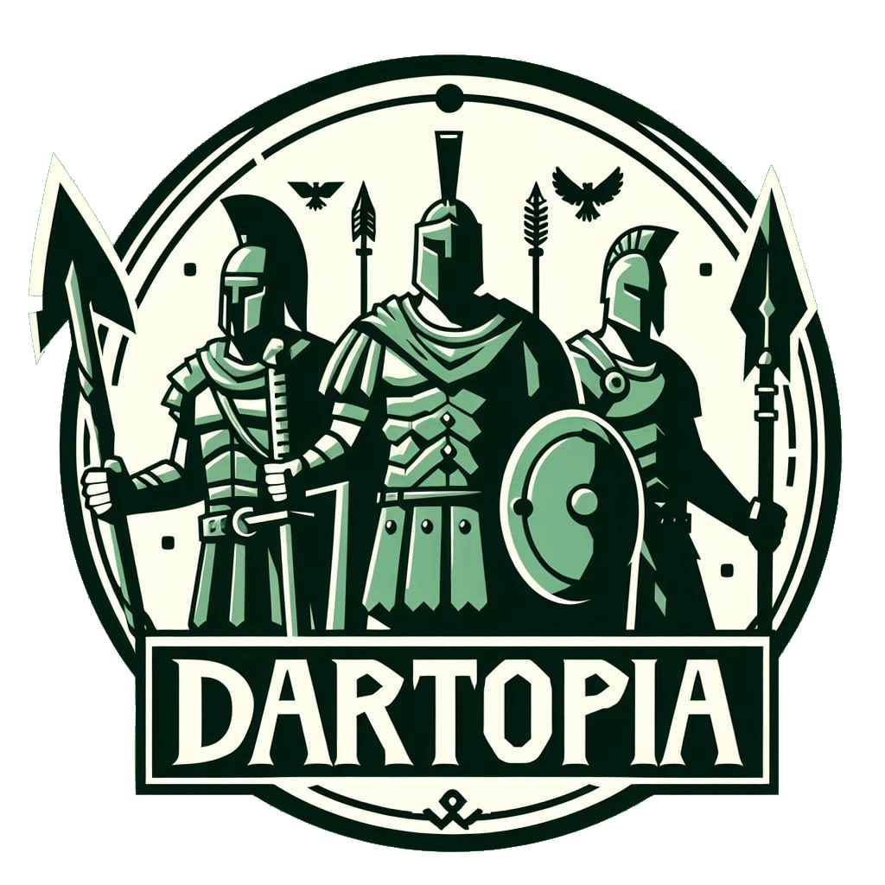

[](https://dartfrog.vgv.dev)

## Dartopia is a persistent, multiplayer, online, real-time strategy game

## Built With

- [Flutter](https://flutter.dev/)
- [Dart Frog](https://dartfrog.vgv.dev/)

## How to run

First, you'll need to clone the repository using the following command in your terminal:

```sh
git clone https://github.com/mrlanu/dartopia.git
```

Next, you'll need to install the dart_frog_cli if you haven't already done. You can do this by running the following command in your terminal:

```sh
dart pub global activate dart_frog_cli
```

There is a docker-compose file in the server/docker folder which will up and run Mongo DB & Mongo Express.
After run the following command you will be able to see the database in the browser on http://localhost:8081/

```sh
docker-compose up -d
```

Inside the server folder, you can start the server by using:

```sh
dart_frog dev
```

After that you should send http request in order to create a new World

```sh
curl -X POST http://localhost:8080/world
```

Finally, you'll need to start the mobile app by running the following command in the client folder:

```sh
flutter run
```
